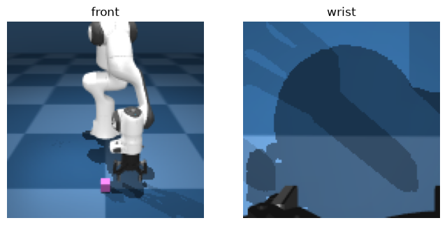

# TP HIL-SERL: report

**Group:** NathGab 
**Students:** Gabriel Medenou & Nathanael 
**Date:** 24/09/2026
**Device used (from `check_setup.py`):** cuda / mps / cpu — GPU model if any:

Replace every `...` with your answer. Insert figures from `runs/plots/` with ``. Keep the report under 6 pages when exported to PDF.

---

## Part 1: Discover the environment

**Human trials (1.2)**

| Operator | Attempt | Success (y/n) | Time (s) | What went wrong |
| --- | --- | --- | --- | --- |
| | 1 | | | |
| | 2 | | | |
| | 3 | | | |
| | 4 | | | |
| | 5 | | | |
| | 1 | | | |
| | 2 | | | |
| | 3 | | | |
| | 4 | | | |
| | 5 | | | |

**Q1.1** 
The observation space contains two RGB camera images (front and wrist), each of size \(128 \times 128 \times 3\), and an 18-dimensional state vector. From the normalisation ranges, the first 7 values are likely the robot joint positions, the next 7 the joint velocities, the 15th value the gripper state, and the last 3 values the Cartesian position \((x,y,z)\) of the end-effector.

The raw simulator has a 7-dimensional action space in \([-1,1]\). After the TP wrappers, the agent only sees a 4-dimensional action space: \([dx,dy,dz,\text{gripper}]\). The first three values command Cartesian displacements of the end-effector, while the last controls the gripper. The wrapper therefore simplifies the original control space by hiding some low-level action dimensions from the RL agent.

**Q1.2** ...

**Q1.3** ...

**Q1.4** Success rate: ... · Mean time to success: ... s · Hardest phase: ...

---

## Part 2: Record demonstrations

Episodes recorded: ... · Successful: ... · Mean length: ... s

**Q2.1** ...

**Q2.2** ...

**Q2.3** ...

---

## Part 3: RL baseline without interventions

**Q3.1** ...

**Q3.2** ...

**Q3.3** ...

**Q3.4** ...

**Q3.5** γ¹⁰⁰ = ... · Implication: ...

---

## Part 4: HIL-SERL with interventions

| Run | First success (min) | Min to rolling reward ≥ 0.8 | Interventions | Human effort (s) |
| --- | --- | --- | --- | --- |
| noHIL | | | — | — |
| HIL | | | | |

**Q4.1** ...

**Q4.2** ...

**Q4.3** Metric proposed: ... · Value for our HIL run: ...

**Q4.4** ...

**Q4.5** ...

---

## Part 5: Experiment ___

**Q5.1 Hypothesis (written before the run):** ...

| Run | First success (min) | Min to rolling reward ≥ 0.8 | Interventions | Human effort (s) |
| --- | --- | --- | --- | --- |
| HIL (first 20 min) | | | | |
| exp ___ | | | | |

**Q5.1 Result:** ...

**Q5.2** ...

---

## Part 6: Class comparison

**Q6.1** ...

**Q6.2** ...

**Q6.3** ...

**Q6.4** ...

**Q6.5** ...
